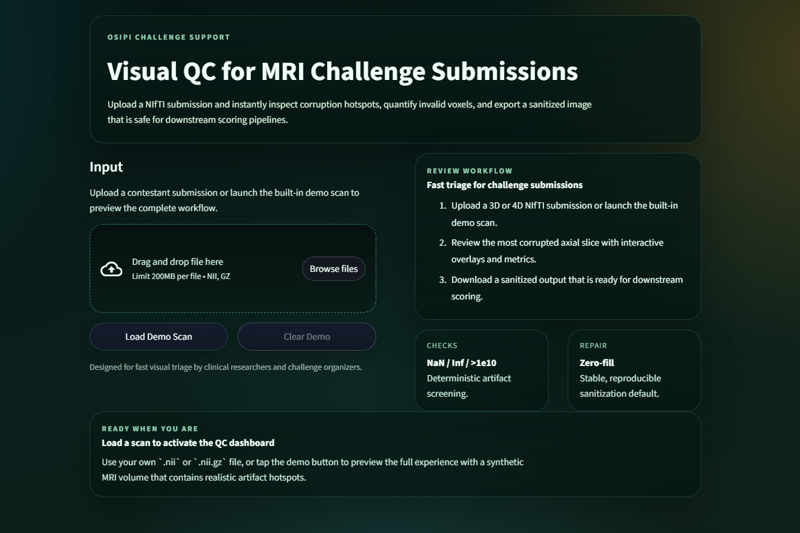
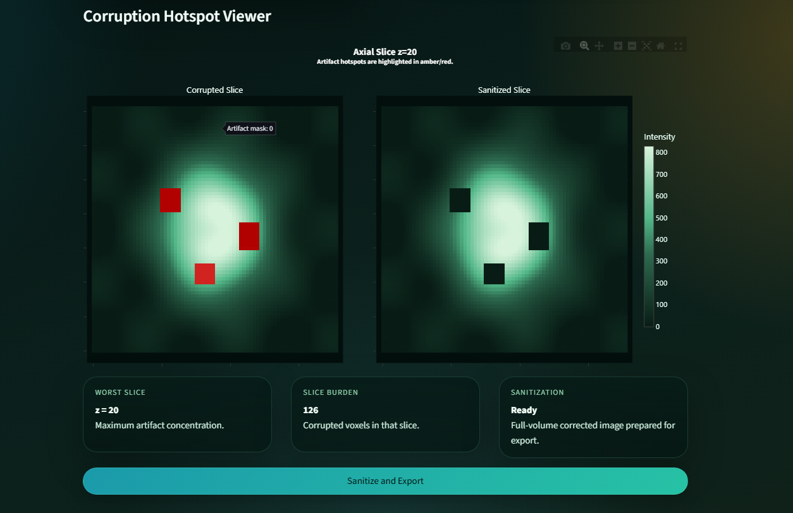
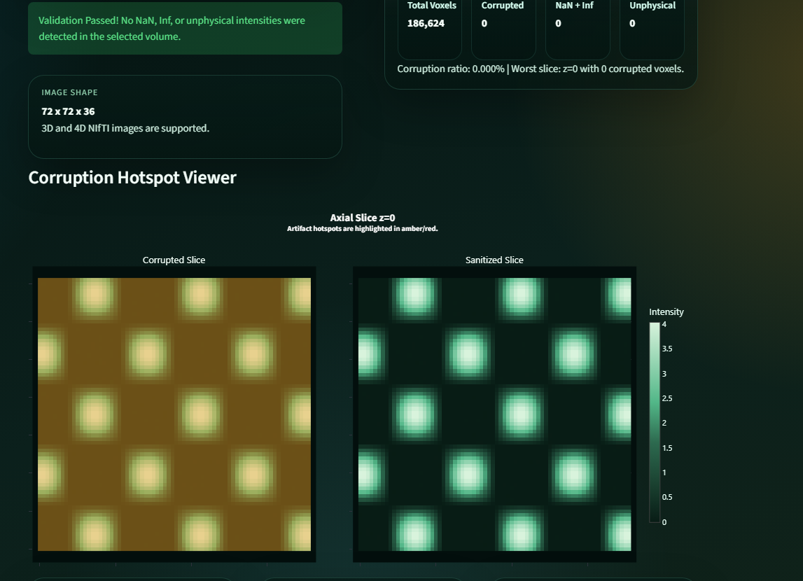

# OSIPI Visual QC

`OSIPI Visual QC` is a Streamlit dashboard for validating MRI challenge submissions in NIfTI format. It helps researchers and challenge organizers catch broken volumes before those files crash downstream scoring or analysis pipelines.

The app focuses on three artifact classes that commonly break quantitative workflows:

- `NaN` voxels
- `Inf` voxels
- unphysical intensities above `1e10`

It then highlights the most corrupted axial slice, shows a side-by-side corrupted versus sanitized view, and exports a repaired NIfTI with invalid values replaced by `0`.

## Screenshots

### Landing page



### Error state with embedded demo data



### Fixed demo data view



## Features

- polished Streamlit UI built for non-programmer reviewers
- drag-and-drop upload for `.nii` and `.nii.gz`
- built-in demo scan for instant walkthroughs
- 3D and 4D image support
- automatic worst-slice detection
- interactive Plotly heatmaps for corrupted and sanitized slices
- one-click sanitized NIfTI export
- deterministic validation and repair logic with pytest coverage

## Project Structure

```text
.
|-- app.py
|-- requirements.txt
|-- Dockerfile
|-- README.md
`-- tests
    `-- test_app.py
```

## What The QC Checks Mean

- `NaN`: "Not a Number" values. These usually appear when an earlier mathematical operation broke, like dividing by zero or propagating an invalid result.
- `Inf`: infinite values. These are often caused by overflow or unstable numerical operations and can break summary statistics immediately.
- `Unphysical`: extremely large voxel intensities above `1e10`. In challenge pipelines, these values are usually not biologically meaningful and often indicate corrupted outputs or failed normalization.

Why this matters:

1. downstream scoring scripts often assume every voxel is finite
2. a single corrupted patch can crash metrics or produce misleading outputs
3. visualizing the worst affected slice lets a reviewer understand the failure instantly rather than reading logs

## Local Development

### 1. Create and activate a virtual environment

```powershell
python -m venv .venv
.venv\Scripts\Activate.ps1
```

### 2. Install dependencies

```powershell
pip install -r requirements.txt
```

### 3. Run the app

```powershell
streamlit run app.py
```

Open [http://localhost:8501](http://localhost:8501) in your browser.

## Running Tests

Run the full test suite with:

```powershell
pytest -q
```

The test suite covers:

- NIfTI loading
- artifact detection
- 4D volume selection
- worst-slice summarization
- intensity-window handling for visualization
- Plotly figure creation
- sanitization behavior
- export payload generation
- demo scan generation
- Streamlit smoke rendering
- empty-state rendering

## Docker

### Build the image

```powershell
docker build -t osipi-visual-qc .
```

### Run the container

```powershell
docker run --rm -p 8501:8501 osipi-visual-qc
```

Then open [http://localhost:8501](http://localhost:8501).

## Deployment

This project is best deployed on [Streamlit Community Cloud](https://streamlit.io/cloud), not Vercel.

Recommended deployment flow:

1. Push this repository to GitHub.
2. Create a new Streamlit Community Cloud app.
3. Select this repo and set `app.py` as the entrypoint.
4. Deploy.

## Why This Project Matters

MRI challenge pipelines often fail for avoidable numerical reasons rather than scientific ones. A single corrupted voxel can break metrics, statistics, or evaluation scripts. This app turns that low-level validation problem into a visual workflow that a clinical researcher can understand immediately.

Instead of reading terminal logs, a reviewer can:

1. upload a scan
2. see exactly where the corruption occurs
3. quantify the issue
4. export a repaired version

That makes the project useful both as a practical QC tool and as a portfolio example of scientific software with strong UX.
